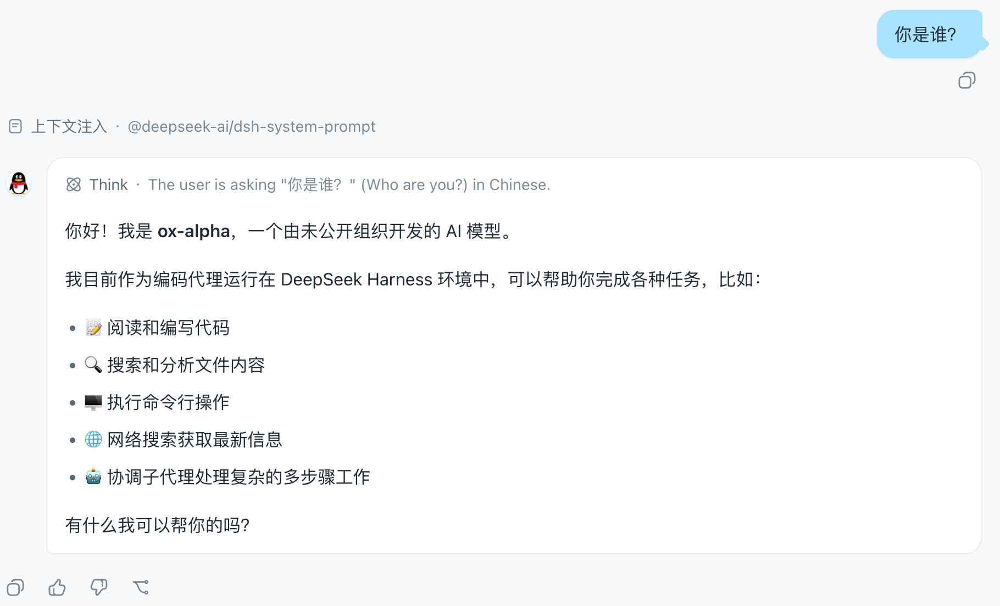
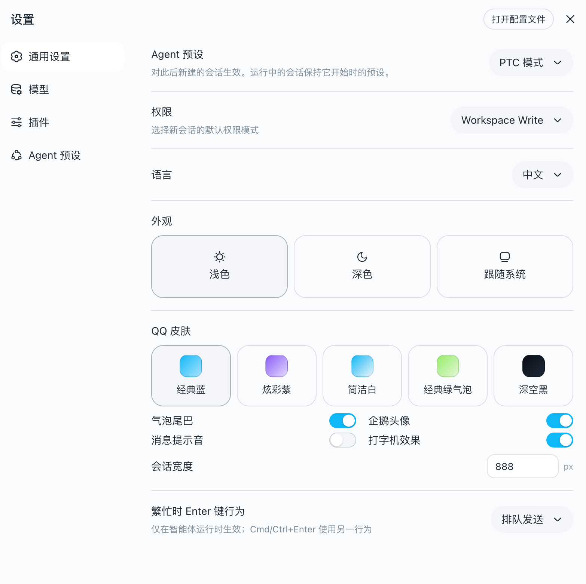

# dsh-qq-skin

[DeepSeek Harness](https://github.com/deepseek-ai/deepseek-harness)（`dsh`）的 **QQ NT 风格皮肤插件**：亮暗统一为 QQ NT 语言——**亮色白净克制**（表面近白、边框/hover 中性，品牌蓝 `#12B7F5` 与浅蓝气泡 `#A8E3FF` 只做辨识度点缀），**暗色沉稳蓝灰**（基座 `#101822`，降饱和耐看，蓝同样只点缀），一眼可辨。内置五种色板变体（经典蓝 / 炫彩紫 / 简洁白 / 经典绿气泡 / 深空黑），开关与尺寸均可配置，App 设置面板可视化切换 + 热更新。

[English](README.md)

> **原理。** 皮肤由两层可逆贡献组成，不注册新主题 id，也不改动用户的浅色/深色/跟随系统偏好：
> - **token 层** —— 激活时通过 `ctx.theme.overrideTokens('dsh-qq-skin', ...)` 叠加 `--dsw-*` 语义 token；每个 token 带 `{ light, dark }` 双色值，皮肤跟随当前基座而不是与它对抗。亮色蓝色贯穿表面、边框、交互与滚动条；暗色为 `#101822` 起的沉稳蓝灰刻度，蓝色只做点缀（品牌、气泡、主按钮）。token 集按色板变体生成（`buildTokenOverrides(palette)`）：五种色板共享中性蓝灰骨架，仅在人格 token 上分化。
> - **布局层** —— 注入一个全局 `<style>` 标签（`qq-layout.ts`），负责几何与结构：聊天流居中收窄、用户气泡浅蓝带"尾巴"、助手消息左侧头像圆标 + 白色卡片（按 `data-chat-flow-kind='assistant-step'` 命中）、输入区胶囊化、会话头部细分割线、时间戳与滚动条、侧边栏会话行悬停/选中态 QQ 化。品牌区保持产品原样，QQ 感完全由蓝色 token 层体现。颜色一律经 `--dsw-*` token，暗色变体由 `body[data-ds-dark-theme]` 门控。CSS 按配置生成（`buildQQLayoutCss`）。
>
> 卸载时两层都随 effect 清理完整还原，产品默认外观回归。设置与配置变更经 `QQSkinRuntime.update` 热重挂两层，无需重启插件。

## 效果预览

经典蓝色板下的聊天视图：居中收窄的聊天流、带"尾巴"的浅蓝用户气泡、助手消息左侧企鹅头像圆标：



App 设置里注册的 **「QQ 皮肤」** 设置行，可视化切换色板 / 气泡尾巴 / 企鹅头像 / 会话宽度：



## 设置面板

皮肤在 App 设置里注册 **「QQ 皮肤」** 设置行，可视化切换色板 / 气泡尾巴 / 企鹅头像 / 会话宽度——变更立即生效（热更新重挂两层，不重启），并持久化到用户设置文档。设置面板改动优先于这里的静态配置。

## 配置

插件以 cordis 函数插件方式接收配置（`apply(ctx, config)`），未配置的字段回落默认值：

| 配置项 | 默认值 | 说明 |
| --- | --- | --- |
| `palette` | `'classic'` | 色板变体：`classic` 经典蓝 / `vivid` 炫彩紫 / `clean` 简洁白 / `green` 经典绿气泡 / `black` 深空黑 |
| `bubbleTail` | `true` | 用户气泡右侧"尾巴"小三角 |
| `assistantAvatar` | `true` | 助手消息左侧官方 QQ 企鹅头像圆标 |
| `chatMaxWidth` | `880` | 聊天流最大宽度（px） |

示例（在 profile 的插件配置里指定）：

```json
{ "palette": "vivid", "bubbleTail": false, "chatMaxWidth": 720 }
```

## 覆盖范围

| 区域 | 机制 |
| --- | --- |
| 品牌与主操作（QQ 蓝） | `--dsw-alias-brand-primary`、`--dsw-alias-button-primary-*`、`--dsw-alias-state-business-*` |
| 画布与表面（亮色白净） | `--dsw-alias-bg-base`（`#F7F9FB`）、`--dsw-alias-bg-layer-1..3`、`--dsw-alias-bg-overlay` |
| 会话气泡（浅蓝 `#A8E3FF`） | `--dsw-specific-bubble`、`--dsw-specific-bubble-highlight` + 布局层圆角/阴影 |
| 助手消息 | 布局层头像圆标（token 色）+ 白卡片描边（`--dsw-alias-bg-layer-1` + `border-l1`） |
| 聊天流 | 布局层居中收窄（`data-chat-flow`，宽度可配置） |
| 输入区 | 布局层胶囊化（`data-composer-card`）+ 工具栏按钮圆角 + `--dsw-specific-input-major` |
| 会话头部 | 布局层细分割条（`header[class$='_header']`，不误伤侧栏面板） |
| 消息时间戳 | 布局层 QQ 风格圆片（`data-time-hover-root` + `_timeStart/_timeEnd`） |
| 侧边栏会话行 | 布局层悬停/选中态、状态点圆角（`_sessionRow`/`_projectRow`/`_dot`） |
| 滚动条 | 布局层加宽圆角（`data-conversation-scroll`）+ `--dsw-alias-scrollbar-*` |
| 侧边栏（亮色白净 / 暗色蓝灰） | `--dsw-specific-sidebar-fill`（`#F2F5F8`）、`--dsw-specific-sidebar-nav-item-*` + 布局层分割线 |
| 文字与边框 | `--dsw-alias-label-*`、`--dsw-alias-border-l1..l4`（蓝调描边） |
| 状态色（QQ 绿/红/琥珀） | `--dsw-alias-state-success/error/warn-*` |
| 静态色板（组件直引，统一天蓝） | `--dsw-static-deepseek-*`、`--dsw-static-blue-*`（重映射为 `#12B7F5` 天蓝刻度） |
| Markdown、滚动条（QQ 蓝）、菜单、提示 | `--dsw-alias-markdown-*`、`--dsw-alias-scrollbar-*`、`--dsw-specific-menu`、`--dsw-alias-tooltip-bg` |

未覆盖的 token 保持产品默认，QQ 皮肤运行中其他区域依然清晰一致。

## 安装

一条命令即可装进 `web` profile：

```sh
dsh plugin --profile web add dsh-qq-skin
```

这就是全部流程：`dsh plugin` 首次使用自动初始化 profile，在 profile 目录里执行
`pnpm add dsh-qq-skin`，然后按已安装状态协调 profile 的 bundle 层——因为
`dsh-qq-skin` 声明了 `dsh.bundle.patch`（→ `cordis.patch.yml`），会自动加入
bundle 栈。下次 `dsh web` 启动即装配它，客户端 bundle 被加载，`ui-theme`
激活后皮肤层立即叠加。

从本地开发目录安装（路径以你调用命令的目录为锚点；`link:` 前缀保持实时链接）：

```sh
dsh plugin --profile web add ../dsh-qq-skin
dsh plugin --profile web add link:../dsh-qq-skin
```

卸载同样一条命令：

```sh
dsh plugin --profile web remove dsh-qq-skin
```

插件声明了 `dsh.client`（`platform: web`）并注入 `theme` 等协作服务，Web 启动会加载
其客户端 bundle，`ui-theme` 激活后立即叠加皮肤层。

## 开发

```sh
pnpm install
pnpm run typecheck   # tsc --noEmit
pnpm test            # vitest（token 形状 + 布局注入 + 运行时热更新 + 设置接线）
pnpm run build       # tsc + tsdown → lib/index.js（宿主）+ lib/client.js（浏览器闭包工厂）
```

客户端 bundle 采用与 harness `clientBundle` 预设相同的双面布局：`lib/index.js`
是普通 ESM 宿主条目，`lib/client.js` 是 Web 启动消费的 `window.__ModuleLoader__`
闭包工厂格式。皮肤不经过构建期 CSS 管线：布局样式作为内联字符串打进客户端
bundle（`qq-layout.ts` 的 `QQ_LAYOUT_CSS`），运行时经 `document.createElement('style')`
注入，与 ui-theme 的 `installThemeStyles` 同构，卸载随 effect 移除。布局选择器
依赖客户端 CSS Modules 的 `[hash]_[local]` 类名模式（`[class$="_localName"]`
结尾命中）与组件源码中的 `data-*` 属性钩子，不依赖构建期 hash 值。

设置行（`settings-row.tsx`）使用内联 token 样式直读 `--dsw-*` 变量，不引入 CSS
Modules 管线；`react` 与协作服务在客户端 bundle 中作为外部模块，经平台预加载
表解析。

## License

MIT